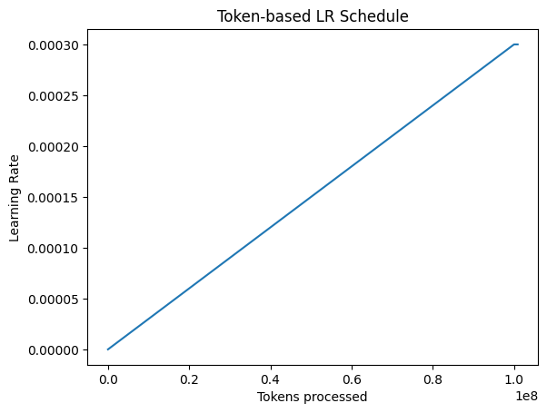

# Token-Based Learning Rate Scheduler for LLM Training

Implementation of a **token-based learning rate scheduler** designed for large language model training.

Unlike traditional schedulers that operate on **training steps**, this implementation schedules learning rate based on **tokens processed**, which better reflects real compute usage in modern LLM training.

## Motivation

Large language models such as GPT-style architectures are typically trained using **token budgets** rather than fixed numbers of steps.

This scheduler implements:

- Token-based warmup
- Cosine decay over a token budget
- Adaptive throughput tracking

## Features

### 1. Token-based scheduling

Learning rate progression depends on the number of tokens processed rather than training steps.

### 2. Cosine decay

After the warmup phase, the learning rate follows a cosine decay schedule.

### 3. Adaptive token throughput

The scheduler tracks token throughput and maintains a smoothed estimate of token processing velocity.

This can be useful in distributed training environments where throughput changes dynamically.

## Visualization



## Project Structure

token_scheduler.py → scheduler implementation  
simulate_training.py → simulated training loop  
plot_schedule.py → LR schedule visualization  

## Example Usage

```python
scheduler = TokenLRScheduler(
    base_lr=3e-4,
    min_lr=3e-5,
    warmup_tokens=1e8,
    total_tokens=3e9
)
```
## Applications

Token-based scheduling is used in training modern models such as:

GPT-style language models

Transformer-based LLMs

Large-scale distributed training systems
